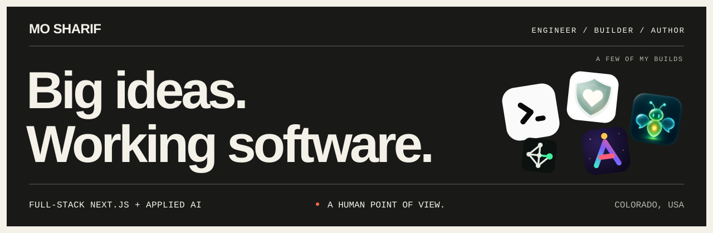

  

  <a href="https://mosharif.me">Portfolio</a> ·
  <a href="https://codelit.io">Codelit</a> ·
  <a href="https://mosharif.me/blog">Writing</a> ·
  <a href="https://www.linkedin.com/in/mo-sharif/">LinkedIn</a> ·
  <a href="mailto:mo@codelit.io">Email</a>

## I build full-stack AI products that still work after the demo.

I'm Mo, a staff-level engineer and product builder in Colorado. I work from product shape and system design through frontend, APIs, data, deployment, and the production edges that decide whether software is actually useful.

Most of my current work lives at the intersection of Next.js, TypeScript, and applied AI. I care about clear interfaces, reliable agent workflows, human control, privacy, accessibility, and evidence over hype.

## What I'm building

| Project | What it does |
| --- | --- |
| **[Codelit](https://codelit.io)** | A visual workspace for building, running, and supervising multi-agent workflows with approvals, evals, browser actions, and GitHub handoffs. |
| **[ResolveMesh](https://resolvemesh.com)** | Source-backed capability routing for AI agents across MCP, A2A, and REST. The [public MCP server](https://github.com/mo-sharif/resolvemesh-mcp) is read-only by design. |
| **[DateSafe](https://getdatesafe.app)** | Private date-safety tools for Date Cards, trusted circles, timed check-ins, and quiet alerts. Also [live on the App Store](https://apps.apple.com/us/app/datesafe-safety/id6784803218). |
| **[AbleMakers](https://ablemakers.org)** | Free, guided AI learning for people with Down syndrome and other intellectual disabilities, with accessible interactions and no required account. |

## Open code and system design

- **[Agent Team Starter](https://github.com/codelit-io/agent-team-starter)**: runnable TypeScript agent teams with approvals and evals.
- **[AI System Architecture Blueprints](https://github.com/codelit-io/ai-system-architecture-blueprints)**: diagrams, threat models, architecture decisions, and cost checks.
- **[Browser QA Agent](https://github.com/codelit-io/browser-qa-agent)**: guarded Playwright QA with screenshots and runtime evidence.
- **[GitHub Repo Maintenance Agent](https://github.com/codelit-io/github-repo-maintenance-agent)**: BYOK issue-to-patch automation with path limits and human approval.
- **[Workflow Check](https://github.com/codelit-io/codelit-workflow-check)**: a zero-dependency validator and GitHub Action for agent workflow contracts.
- **[Agent Team Examples](https://github.com/codelit-io/agent-team-examples)**: reviewed workflows for releases, incidents, refunds, leads, and research.
- **[ResolveMesh MCP](https://github.com/mo-sharif/resolvemesh-mcp)**: source-backed compatibility lookups for AI coding agents.

## More things I've shipped
- **[The Plant Was Never the Problem](https://www.amazon.com/dp/B0HC3Z4JZK?tag=mosharif-20)**: how engineering managers help people speak up, grow, and ship.
- **[From Prompt to Proof](https://www.amazon.com/dp/B0HC1L3L4M?tag=mosharif-20)**: a practical guide to using AI to think clearly, finish real work, and verify what matters.
- **[PixelForge UI](https://github.com/pixelforge-ui/pixelforge-ui)**: an accessibility-first React and TypeScript component library with a bold visual system.
- **[Ember Coast](https://embercoasttravel.com)**: a full-stack luxury travel planning product.
- **[ViralVault](https://viralvaulttech.vercel.app)**: a builder-focused brief on AI, infrastructure, and security shifts.
- **[stdout](https://github.com/mo-sharif/stdout)**: autonomous developer stories generated and published from local hardware.
- **[vault-kalshi](https://github.com/mo-sharif/vault-kalshi)**: a clean-room forward-test lab with reproducible data and honest negative results.

[Browse all public repositories →](https://github.com/mo-sharif?tab=repositories)

## How I work

- I own the path from a fuzzy product problem to production.
- I design AI systems around fallbacks, approvals, evidence, and clear failure states.
- I care about accessibility, privacy, cost, and the boring operational details.
- I leave behind tests, documentation, and systems that are easier to operate.

  <code>Next.js</code>
  <code>TypeScript</code>
  <code>React</code>
  <code>Node.js</code>
  <code>AI agents</code>
  <code>MCP</code>
  <code>PostgreSQL</code>
  <code>Playwright</code>
  <code>Expo</code>
  <code>Vercel</code>

I like ambitious systems, small interfaces, and shipping the last mile.

**[Read the notes](https://mosharif.me/blog)** · **[Say hello](mailto:mo@codelit.io)**
